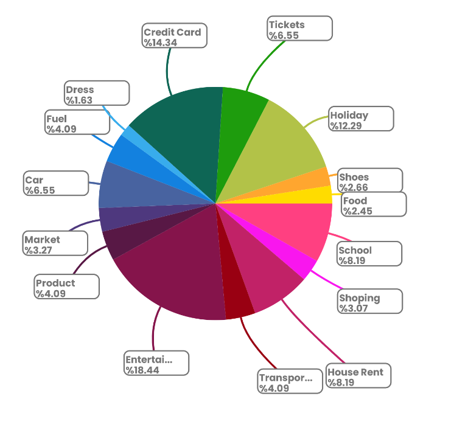
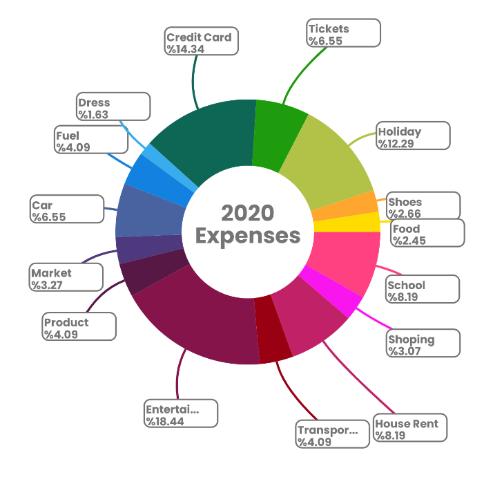
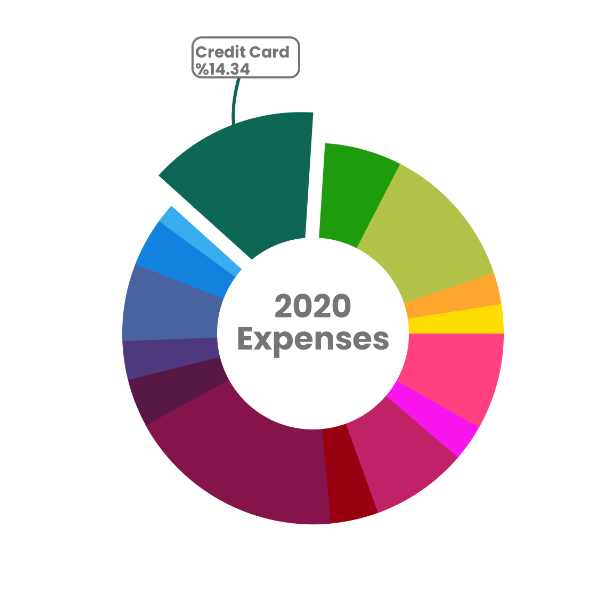
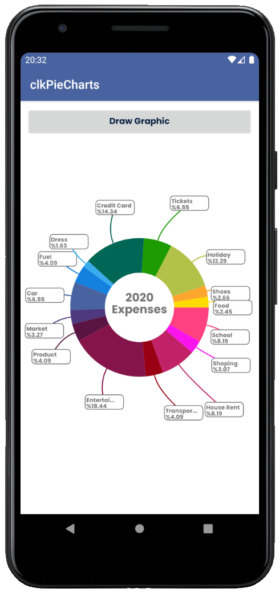

# clkPieCharts

## Pie Chart and Donut Chart 

The clkPieCharts library allows you to easily create stylish pie and donut graphics in your application. 
  

## GetStarted

Step 1 : Add it in your root build.gradle at the end of repositories:  

    allprojects {
        repositories {
          maven { url 'https://jitpack.io' }
        } 
    }
  
Step 2. Add the dependency

    dependencies {
            implementation 'com.github.colakcode:clkPieCharts:v0.1.1'
    }

## Usage

#### XML File

Add a RelativeLayout of equal width and height to your XML file.

    <RelativeLayout
        android:layout_width="300dp"
        android:layout_height="300dp"
        android:id="@+id/layoutGraph"/>
        
 
        
#### JAVA Code

Define a pieObject in the form of an ArrayList and enter the id, name, value, and color variable values.

        List<PieObject> pieObjects = new ArrayList<>();
        pieObjects.add(new PieObject("023456", "School", 2000, Color.RED));
        pieObjects.add(new PieObject("123456", "Shoping", 750, Color.BLUE));
        pieObjects.add(new PieObject("234567", "House Rent", 2000, Color.GREEN));
        pieObjects.add(new PieObject("456789", "Entertainment", 4500, Color.YELLOW));

You can also use PieObject without entering a color value. If you do not enter a color value, the library will choose one of the predefined colors. 

        pieObjects.add(new PieObject("#107456789", "Credit Card", 3500));

Then define an object from PieChart class and add it to your relative layout.

        RelativeLayout layoutGraph = findViewById(R.id.layoutGraph);
        PieChart pieChart = new PieChart(this, pieObjects, layoutGraph)
        layoutGraph.addView(pieChart);

You can use the same features for DonutChart.

        RelativeLayout layoutGraph = findViewById(R.id.layoutGraph);
        DonutChart donutChart = new DonutChart(this, pieObjects, layoutGraph)
        layoutGraph.addView(donutChart);

### Usage of Interface

If you click on a pie slice on the graph, the following information is returned to your activity class with the interface method. For this, you must implement the necessary interfaces for Donut and Pie Charts.

#### JAVA Code

        public class MainActivity extends AppCompatActivity implements ClickPieSlice, ClickDonutSlice {

                private static final String TAG = "clk_MainActivity";
                private RelativeLayout layoutGraph;
                private List<PieObject> pieObjects;
                private DonutChart donutChart;

                @Override
                protected void onCreate(Bundle savedInstanceState) {
                        super.onCreate(savedInstanceState);
                        setContentView(R.layout.activity_main);

                        List<PieObject> pieObjects = new ArrayList<>();
                        pieObjects.add(new PieObject("023456", "School", 2000));
                        pieObjects.add(new PieObject("123456", "Shoping", 750));

                        layoutGraph = findViewById(R.id.layoutGraph);
                        donutChart = new DonutChart(this, pieObjects, layoutGraph)
                        layoutGraph.addView(donutChart);
                }

                @Override
                public void getPieSliceInfo(PieObject pieObject, int position, double percentage) {
                        Log.d(TAG, "getSliceInfo: " + "\n" +
                                "position : " + position + "\n" +
                                "id : " + pieObject.getId() + "\n" +
                                "name : " + pieObject.getName() + "\n" +
                                "value : " + pieObject.getValue() + "\n" +
                                "percentage : " + percentage);
                }

                @Override
                public void getDonutSliceInfo(PieObject pieObject, int position, double percentage) {
                        Log.d(TAG, "getSliceInfo: " + "\n" +
                                "position : " + position + "\n" +
                                "id : " + pieObject.getId() + "\n" +
                                "name : " + pieObject.getName() + "\n" +
                                "value : " + pieObject.getValue() + "\n" +
                                "percentage : " + percentage);
                }
        }

### Other methods you can use
        
        pieChart.setBackgroundColor(Color.BLACK);
        donutChart.setBackgroundColor(Color.BLACK);
        
In the DonutChart you can add text in the middle.

        donutChart.setMiddleText("Expenses 2020");

You can select one of the objects and pass it to the chart without clicking on the chart.
        
        donutChart.selectObject(position);
        
***position** = position of the selected object*

Clicking on an empty area resets the graph. You can also do this outside of the graphic.
        
        pieChart.resetGraph();
        donutChar.resetGraph();

### Compatibility and Some Other Notes
The clkPieCharts library is written in java and requires a minimum Android API level of 21.

### Some Visuals from clkPieCharts

 
 
    
## Author
Kemal ÇOLAK [@colakcode](https://github.com/colakcode/) on GitHub

## License

The MIT License (MIT)

Copyright (c) 2020 Kemal ÇOLAK

Permission is hereby granted, free of charge, to any person obtaining a copy of this software and associated documentation files (the "Software"), to deal in the Software without restriction, including without limitation the rights to use, copy, modify, merge, publish, distribute, sublicense, and/or sell copies of the Software, and to permit persons to whom the Software is furnished to do so, subject to the following conditions:

The above copyright notice and this permission notice shall be included in all copies or substantial portions of the Software.

THE SOFTWARE IS PROVIDED "AS IS", WITHOUT WARRANTY OF ANY KIND, EXPRESS OR IMPLIED, INCLUDING BUT NOT LIMITED TO THE WARRANTIES OF MERCHANTABILITY, FITNESS FOR A PARTICULAR PURPOSE AND NONINFRINGEMENT. IN NO EVENT SHALL THE AUTHORS OR COPYRIGHT HOLDERS BE LIABLE FOR ANY CLAIM, DAMAGES OR OTHER LIABILITY, WHETHER IN AN ACTION OF CONTRACT, TORT OR OTHERWISE, ARISING FROM, OUT OF OR IN CONNECTION WITH THE SOFTWARE OR THE USE OR OTHER DEALINGS IN THE SOFTWARE.

